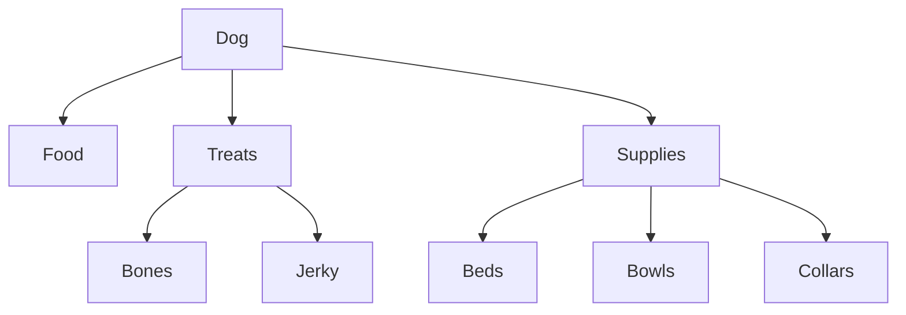
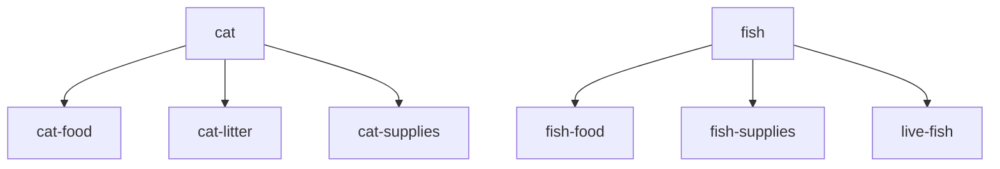
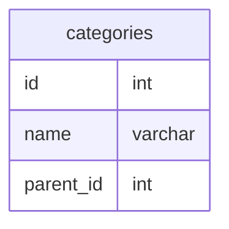
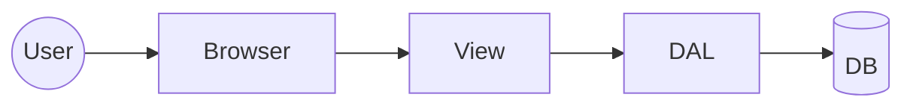
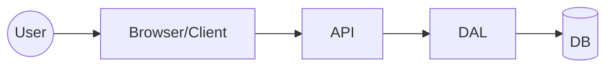
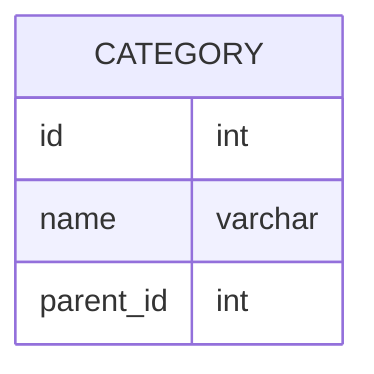

# Hierarchical Category

## Problem

> Implement a hierarchical category that is easy to graft and prune. Explain how the data joins would occur. What are the advantages and complexities of maintaining such a hierarchical category.

## Introduction

The maintenance and presentation of hierarchical data is a relatively common scenario within application development.

There are several different patterns that can be used to manage hierarchical data and each may have advantages and disadvantages with respect to various concerns such as reading, maintaining, transporting and ensuring the consistency of the data.

## General Assumptions

By _hierarchical category_ we shall assume that we require a classification system that will be used within our application, something similar to what might be found in an online storefront where goods and services are classified for presentation.

With the use of the term _hierarchical_ it is assumed that there is a top-down relationship structure where each node belongs to a single parent node - basically what is often referred to as a _tree structure_.

Because there is no mention it is assumed that there are no special requirements for structured, human-friendly identification or naming conventions. Some categorization systems such as the [UNSPSC](https://en.wikipedia.org/wiki/UNSPSC) have the hierarchy built directly into the identification structure where something like `44121706 - Wooden Pencils` is structured beneath `44120000 - Office Supplies` by nature of the common `4412` wihin their numbering scheme.

Also, because the problem statement mentions specifically the ability to _graft_ and _prune_ it would renforce the previously-mentioned notion that the hierarchical structure of the data is not built into the identifer or nomenclature of the individual entries -- they are individual _categories_ that can be structured and restructured as needed.

Assuming that our _categories_ are needed for an application and because the problem statement specifically mentions _joins_, it is assumed that we are building a multi-tiered web application that persists data to a Relational Database System (RDBMS) and that this solution should emphasize the advantages and disadvantages at the database level.

## Solution Overview

- Our primary subject/model will be referred to as _Category_ and our application may have multiple _Categories_
- Each _Category_ must belong to a single _Parent_ (aka _Parent Category_)
- Each _Category_ may have one or more direct _Children_
- There will be at least 1 but potentially multiple _Root Categories_ -- categories that reference themselves as _Parent_

For the purpose of demonstration our fictional Pet Shop has 3 departments: Dog, Cat and Fish. Each department is represented by a _Root Category_ as displayed below.





## Persistence

### Parent Reference

From my experience the most common pattern used for maintaining hierarchical data in an RDBMS is to have each item in the hierarchy contain a reference to the adjacent parent item.

In our case _Category_ data is stored in a single table where each record contains an `id` column and also another column, `parent_id`, that references the id of the parent to the current record. A self-referencing foreign key between the `id` and `parent_id` columns in order to provide referential integrity



**categories table**

| id  | name     | parent_id |
| --- | -------- | --------- |
| 1   | Dog      | 1         |
| 2   | Cat      | 2         |
| 3   | Fish     | 3         |
| 4   | Food     | 1         |
| 5   | Treats   | 1         |
| 6   | Supplies | 1         |
| 7   | Bones    | 5         |
| 8   | Jerky    | 5         |
| 9   | Beds     | 6         |
| 10  | Bowls    | 6         |
| 11  | Collars  | 6         |

#### Advantages

- Very simple to understand
- Easy to identify/select Root categories (`WHERE parent_id = id`)
- Easy to implement safeguards (aka referential integrity)
  - `parent_id` can be required
  - FK constraint between `categories.id` and `categories.parent_id`
- Easy to restructure the hierarchy
  - Update `parent_id` to easily relocate category (and all decsendants)

#### Disadvantages

- Limited to tree structures (single parent)
- Can be more difficult to select lists _ancestors_ and _descendents_ (_n_ join problem)
  - highly-dependent upon DB vendor and overall system architecture
    - Many modern RDBMS provide ability to perform recursive queries
    - Data access and/or client layer of application can employ caching strategies to offset complex queries

#### Closure Table

Alternatively one could use another persistence pattern that is sometimes called _closure table_. In this case our hierarchical relationships are stored in a separate table that could look something like below

```mermaid
erDiagram
  categories {
      id int
      name varchar
  }
  category_relationships {
    ancestor_id int
    descendant_id int
  }
  categories ||--o{ categories
```

## Context is Key

_server-rendered web application_



_client-server application_




